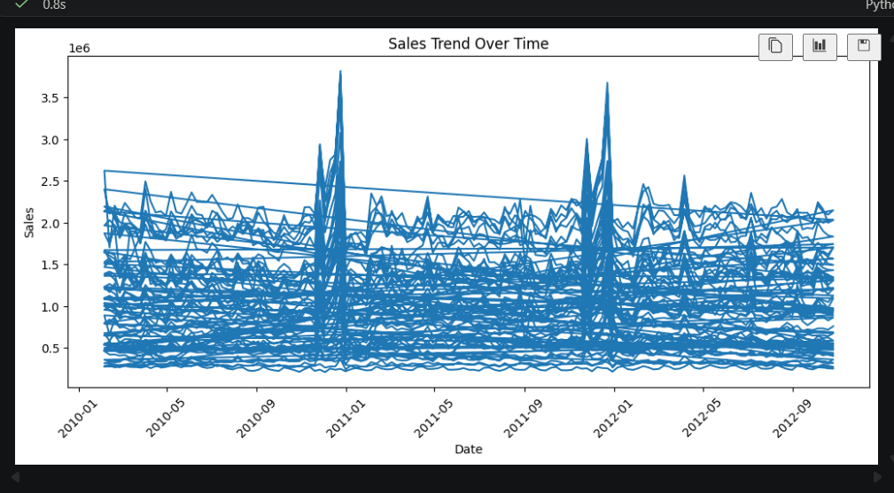
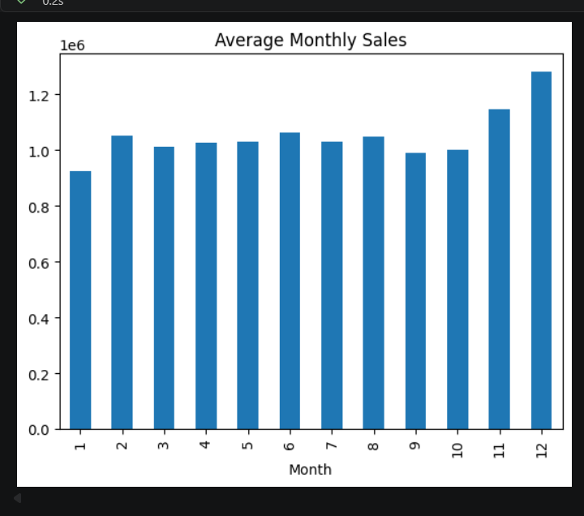
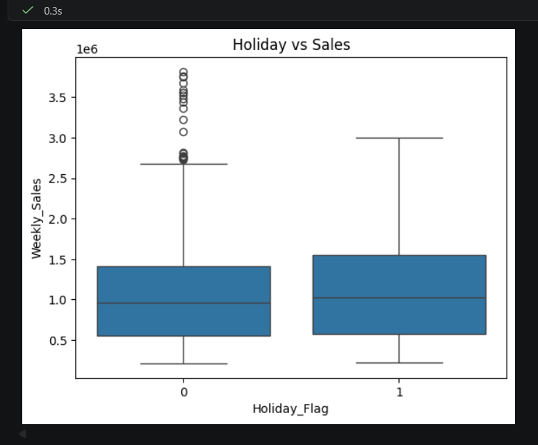
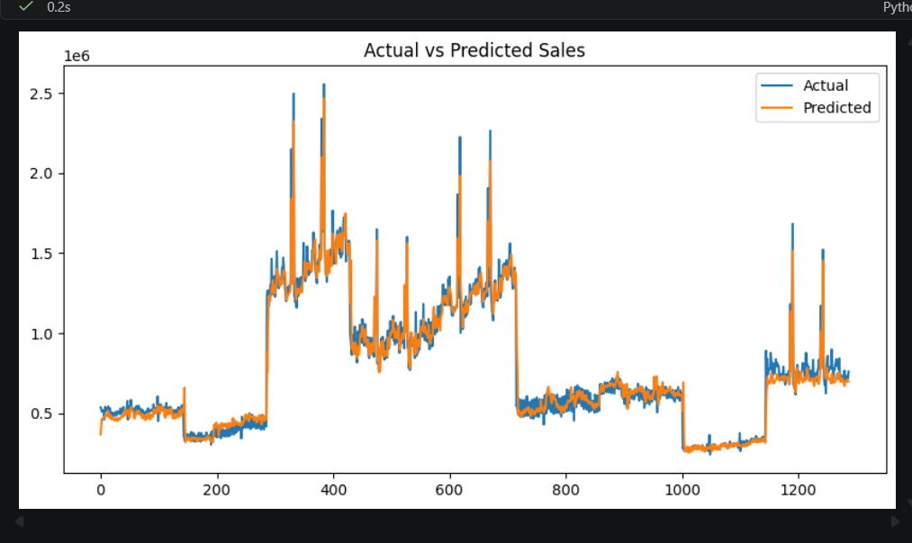
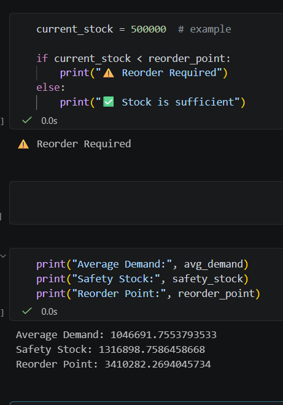

## 🛒 Retail Sales Forecasting & Inventory Optimization
---

## 🚀 Project Overview

This project is an AI-powered system designed to forecast retail sales and optimize inventory levels using machine learning techniques. It simulates a real-world retail environment and helps businesses make data-driven decisions.

---

## ❗ Problem Statement

Retail businesses face challenges like:

- Overstocking (high storage cost)
- Understocking (lost sales)
- Uncertain demand

This project predicts demand and automates inventory decisions.

---

## 🏭 Industry Relevance

Useful for:

- Retail chains
- E-commerce platforms
- Supply chain systems
- Warehouse management

---

## 💼 Business Value

- Reduces stock-out
- Optimizes inventory
- Saves cost
- Automates reorder decisions

---

## 🛠 Tech Stack

- Python
- Pandas
- NumPy
- Matplotlib
- Statsmodels
- Jupyter Notebook

---

## 🧠 Architecture

Data → Cleaning → EDA → Feature Engineering → Forecasting → Inventory Logic → Output

---

```

## 📂 Folder Structure

Retail-Sales-Forecasting/
│
├── dashboard/
│   └── app.py
│
├── data/
│   ├── raw/
│   │   └── walmart.csv
│   └── processed/
│
├── notebooks/
│   ├── 01_EDA.ipynb
│   ├── 02_Feature_Engineering.ipynb
│   └── 03_Model.ipynb
│
├── src/
│   ├── data_preprocessing.py
│   ├── forecasting.py
│   ├── inventory.py
│   └── utils.py
│
├── images/
│   ├── sales_trend.png
│   ├── monthly_sales_analysis.png
│   ├── holiday_sales_impact.png
│   ├── actual_vs_predicted.png
│   └── inventory_decision.png
│
├── outputs/
│   └── results.txt
│
├── reports/
│
├── models/
│
├── requirements.txt
├── README.md
└── main.py

```

---

## ⚙️ Installation

1. Clone repo:
   git clone https://github.com/keshkarsaloni-lab/Retail-Sales-Forecasting.git

2. Go to folder:
   cd retail-sales-forecasting

3. Create venv:
   python -m venv venv

4. Activate:
   venv\Scripts\activate

5. Install:
   pip install -r requirements.txt

   ---

## 📊 Dataset

Walmart dataset with:
Store, Date, Weekly_Sales, Holiday_Flag, Temperature, Fuel_Price, CPI, Unemployment

---

## ▶️ How to Run

1. Run:
   jupyter notebook

2. Open:
   notebooks/03_Model.ipynb

3. Click Run All

---

## 🔁 Simulation Workflow

- Load data
- Clean data
- EDA
- Feature engineering
- Forecasting
- Demand simulation
- Seasonality
- Stock simulation
- Stock-out detection
- Reorder logic

---

## 📈 Results

- Accurate forecasting
- Inventory optimization
- Reorder automation

---

## 📸 Screenshots

### 📊 Sales Trend


### 📈 Monthly Sales


### 🎉 Holiday Impact


### 🤖 Forecast vs Actual


### 📦 Inventory Decision


---

## 🚀 Future Improvements

- LSTM models
- Dashboard (Streamlit)
- Real-time data

---

## 📚 Learning Outcomes

- Time series forecasting
- Inventory logic
- ML project building

---

## 👩‍💻 Author

Saloni Keshkar

---